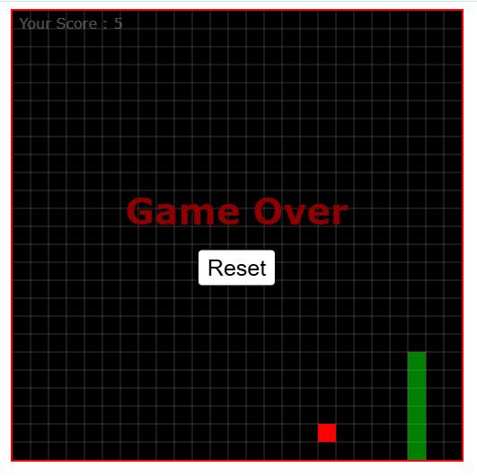

# 🐍 Snake Game

Un remake du classique Snake Game, entièrement développé en HTML, CSS et JavaScript Vanilla. 
Ce projet a été conçu dans le but de renforcer ma compréhension du **DOM**, 
**des événements clavier**, **la récursivité**, et de **la gestion des états en JavaScript**.


## 🎮 Fonctionnalités :

- Contrôle du serpent via les flèches directionnelles
- Génération aléatoire de nourriture
- Détection de collision (avec soi-même, les murs, et la nouriture)
- Système de score en temps réel
- Game Over et Reset 
- Design très simple
- Un écran de jeu qui peut ou non être divisé en petits bloc 


## 🛠️ Technologies utilisées :

- HTML5
- CSS3
- JavaScript (ES6: utilisation des modules ES, déclaration des classes, la déstructuration...)
- jsDoc (pour commenter le code)


## 🎓 Objectifs pédagogiques :

- Maîtrise de la logique de boucle de jeu (via setTimout avec un appel récursive)
- Manipulation dynamique du DOM
- Gestion des événements utilisateurs
- Reforcer ma logiques algorithmiques
- Maîtrise de l'utilisation de jsDoc


## 📸 Captures d'écran :

**Ecran de jeu divisé en bloc (lines et colonnes)**


**Ecran de jeu sans lines et colonnes**


## ✅ Essayez le jeu :

1 - clonez le projet
```
git clone https://github.com/iliasseAbdessamad/snake_game_with_vanilla_js.git
``` 

2 - Accédez au projet
```
cd snake_game_with_vanilla_js
``` 

3 - Démarrez un serveur en définissant le chemin du projet comme racine (si vous avez php installé, vous pouvez tapez la commande suivante)
```
php -S localhost:8988
``` 
 

<br />
<hr />
<br />

- **💻 Réalisé par :** Iliasse Abdessamad
- **📖 But :** renforcer mes connaissances en javascript (vanilla), et jsDoc 
- **Année :** 2024 - 2025


